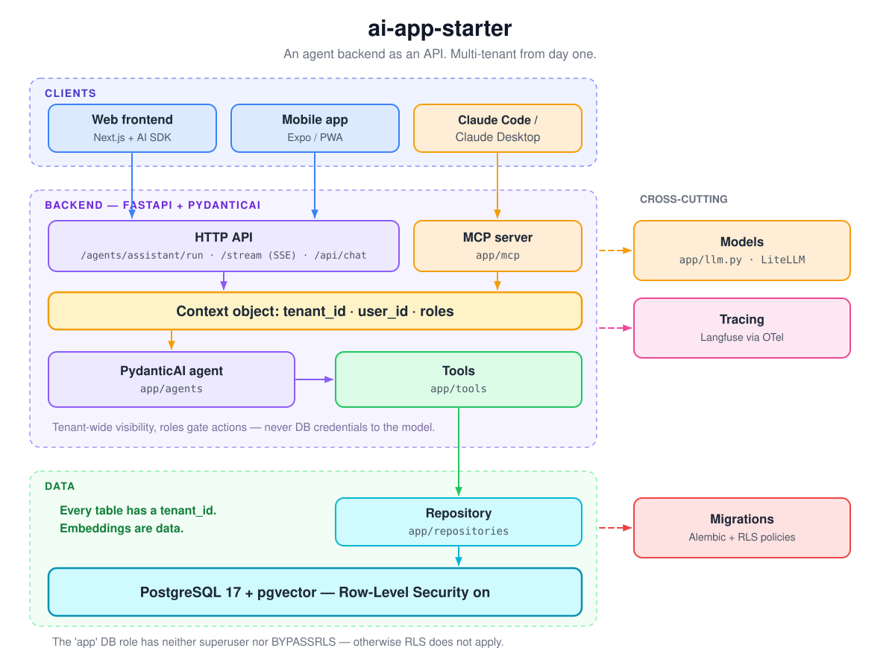

# 🦭 bulkhead

**Secure by design, not by discipline.** A multi-tenant backend for AI agents where tenant
isolation, human approval of every write, and data residency are load-bearing architecture —
enforced by the database and refused at startup, never left to a code review.

[](https://github.com/JulesCyb/bulkhead/actions/workflows/ci.yml)
[](LICENSE)
[](pyproject.toml)
[](app/agents/assistant.py)
[](docs/mcp-connection.md)
[](migrations/versions/0001_initial.py)
[](https://github.com/JulesCyb/bulkhead/stargazers)
[](https://github.com/JulesCyb/bulkhead/issues)

<p align="center">
  
</p>

<p align="center"><sub>The diagram is code: <code>uv run python scripts/render_architecture.py</code> regenerates it.</sub></p>

## Why this exists

Everyone is vibe-coding AI apps right now. Almost nobody is vibe-coding the security.

The first customer's data sits in the same table as the second customer's. The agent writes
whatever a poisoned document tells it to. "We'll add auth later" ships on Friday. None of that
is a bug you fix afterwards — it's the shape of the thing you built.

bulkhead gives you a different shape on day one: tenant isolation the database enforces, a
human's approval before any agent writes, EU data that stays in the EU. Keep vibe-coding on
top. The hull doesn't leak.

## Three things your agent cannot do

1. **Read another tenant's rows.** Row-Level Security is `FORCE`d on every table; the app
   connects as a role with neither superuser nor `BYPASSRLS`; a reused pooled connection
   without a tenant context sees nothing (the `NULLIF` policy, migration 0040).
2. **Write without a human's yes.** Every writing tool is a pending action stored server-side
   with a hash of its exact arguments; the answer is checked against that record, never the
   client's message; there is no "always allow" for a person, by design (ADR-0007).
3. **Send content out of its jurisdiction.** Model, embeddings, and traces each resolve their
   route from the tenant's own residency; an unlisted host fails closed — at startup, before
   the first request (ADR-0008).

Web, mobile, and Claude Code are three clients of the same API and the same MCP server; one
context object (`tenant_id`, `identity_id`, roles) travels through every request, agent run,
tool call, and database transaction. No global state. Tools are
isolated by tenant, not by individual member — every member of a tenant can see every document
of that tenant today; per-member visibility is not implemented.

> **As of 2026-08** (PydanticAI 2.x, MCP SDK 2.x, FastAPI 0.14x). Before deriving a project,
> run `uv lock --upgrade` and update the model names in `.env.example` and
> `docker/litellm/config.yaml`.

---

## Quickstart

```bash
uv sync --group dbtest              # dbtest only if you want the real RLS test
cp .env.example .env                # add keys and model names
docker compose up -d --wait postgres    # --wait blocks until the healthcheck passes
uv run python scripts/migrate.py    # migrations run once per database alias; this brings every known alias to head
uv run python scripts/operator.py create "My Tenant" --residency eu --admin-email me@example.com   # prints tenant/identity IDs
uv run uvicorn app.main:app --reload
```

Migrations run once per database alias (ADR-0002): `scripts/migrate.py` with no argument brings
every alias the control plane currently knows about to head; naming one alias explicitly
(`uv run python scripts/migrate.py <alias>`) migrates only that database, leaving every other
alias untouched.

First call (dev headers are enough locally):

```bash
curl -X POST localhost:8000/v1/t/<TENANT>/agents/assistant/run \
  -H 'Content-Type: application/json' \
  -H 'X-Identity-Id: <IDENTITY>' \
  -d '{"prompt": "What do my documents say about notice periods?"}'
```

Tests: `uv run pytest` — the RLS integration test is skipped when `pgserver` is missing.

## What's inside

| Building block | File | Purpose |
|---|---|---|
| Context object | `app/context.py` | `tenant_id`, `identity_id`, roles — passed through everywhere |
| Auth | `app/deps.py` | tenant from the URL path; `X-Identity-Id` header locally (dev-headers) or a verified bearer token (`AUTH_MODE=jwt`) |
| Tenant session | `app/db/session.py` | `set_config('app.tenant_id', …)` per transaction; also resolves which database answers a tenant's request — pooled by default, dedicated on demand (ADR-0002, whose "Revisit when" list is the one place that names the triggers) |
| Schema + RLS | `migrations/versions/0001_initial.py` | tenants, users, documents (vector 1536), policies, grants |
| Roles | `docker/postgres/01-init.sh` | `app` (no superuser/BYPASSRLS, the long-running API's own role) and `app_owner` (no superuser/BYPASSRLS, owns every object, runs migrations only) |
| Repository | `app/repositories/documents.py`, `app/repositories/conversations.py` | the only path to the DB — vector search, and server-held conversation history under RLS (ADR-0006) |
| Retention | `app/retention.py`, `scripts/retention.py` | deletes each tenant's expired conversations (and their messages) through the same tenant-bound session every request uses — default 90 days, overridable per tenant via `tenants.settings["retention_days"]` (ADR-0006) |
| Tools | `app/tools/documents.py` | context-aware search, plus the one worked writing-tool example (`rename_document`), shared by agent and MCP |
| Approvals | `app/tools/approvals.py`, `app/repositories/pending_actions.py`, `app/repositories/standing_grants.py`, `app/repositories/approval_audit.py` | ADR-0007: a writing tool runs only after a member's approval (checked against a server-side pending action, never the client's message) or, for an agent identity with no person present, a tenant admin's standing grant for that one tool; every approval, refusal, and execution is an append-only audit record naming the actor and the means |
| Agents | `app/agents/assistant.py` | two PydanticAI agents, split on purpose (ADR-0007): a one-shot agent (reading tools only, used by `/agents/assistant/run` and `/agents/assistant/stream`) and a chat agent (every reading tool plus the writing tool, used only by `/api/chat`, where an approval round-trip can exist); model resolved at runtime, tracing metadata |
| API | `app/api/` | `/v1/t/{tenant_id}/agents/assistant/run`, `/v1/t/{tenant_id}/agents/assistant/stream` (SSE, both one-shot, no memory); `/v1/t/{tenant_id}/api/chat` (Vercel AI SDK) — server-held history: the server loads the stored conversation, trusts only the client's newest member-authored message, and persists the run's new messages back through the repository once it completes, independent of the client's own stream (ADR-0006) |
| MCP server | `app/mcp/server.py` | the same tools for Claude Code / Claude Desktop: `stdio` for local development, `streamable-http` (production, requires a bearer token — no token, no connection outside local dev) mounted at `/v1/t/{tenant_id}/mcp` with per-connection identity (ADR-0005); the connecting client's own model sits outside residency enforcement — see [`docs/mcp-connection.md`](docs/mcp-connection.md) and [`docs/residency.md`](docs/residency.md#the-mcp-boundary) |
| Models | `app/llm.py`, `app/embeddings.py` | provider abstraction; the LiteLLM gateway is mandatory, not an add-on (ADR-0009) — enforced at startup: `Settings` refuses to construct without `LITELLM_BASE_URL` |
| Residency | `app/residency.py`, `app/startup_checks.py` | per-tenant model/embedding/trace routing, fail-closed at request time and at startup (ADR-0008) — see [`docs/residency.md`](docs/residency.md) |
| Tracing | `app/observability.py` | Langfuse via OTel, a regular dependency (not optional); content-free by default, per-tenant opt-in, one trace sink per residency (ADR-0008) |
| Operator tool | `app/operator/`, `scripts/operator.py` | audited `create`/`list` commands, run as `app_owner`; `create` provisions a pooled tenant end to end (control-plane record, gateway credential, first admin membership) — replaces the retired `scripts/seed.py` |
| Tests | `tests/` | unit (TestModel, no DB) + a real RLS test against embedded Postgres |

## The four rules that hold it together

1. **Every new table gets a `tenant_id`** — plus an index, `FORCE ROW LEVEL SECURITY`, and a
   policy on `current_setting('app.tenant_id')`. Template and checklist live in
   `migrations/versions/0001_initial.py` and `migrations/script.py.mako`.
2. **The app connects as the `app` role** — no superuser, `NOBYPASSRLS`. Migrations and the
   operator tool (`scripts/operator.py`) run as the separate, non-superuser `app_owner` role via
   `DATABASE_URL_MIGRATIONS`; the API
   container never holds that connection string or the `app_owner`/Postgres cluster passwords —
   only its own `DATABASE_URL` for `app` (see the `api`/`migrate` blocks in
   `docker-compose.yml`). Operator-owned facts about a tenant (isolation tier, residency,
   suspension state) live in a `control` schema owned by `app_owner`; `app` can only read them
   through views. Break the role split and RLS is void — and the bug only surfaces with the
   second tenant.
3. **DB access only through repositories**, agent access only through tools. Tools return what is
   needed — everything returned ends up in the prompt sent to the model provider. Every writing
   tool requires approval (ADR-0007): a member's approval is checked against a server-side
   pending action, never the client's message, and an agent identity may write only under a
   tenant admin's standing grant for that one tool — never an "always allow" for a person.
4. **Embeddings are data.** They live in the same table under the same policy, and cache keys
   include the `tenant_id`.

In full, with commands and conventions: [`CLAUDE.md`](CLAUDE.md).

## Make it your own

1. Copy the repo (`degit`, "Use this template", or clone without `.git`); replace the name in
   `pyproject.toml`, `CLAUDE.md`, and `.env.example`.
2. Fill in the pre-created stub `docs/adr/0001-architecture.md` — here is a
   [filled-in example](https://github.com/JulesCyb/ai-app-blueprints/blob/main/assets/adr-0001-example.md)
   from the skill repo.
3. Set `LLM_MODEL` and `EMBEDDING_MODEL`. **Careful:** the embedding dimension is baked into the
   migration — switching models means a new migration.
4. Add your domain tables as a new migration; work through the checklist in `script.py.mako`.
5. Add tools in `app/tools/`, extend the MCP server, adjust the agent instructions.
6. Attach clients: [`docs/frontend.md`](docs/frontend.md) (Next.js),
   [`docs/mobile.md`](docs/mobile.md) (Android/iOS), [`docs/deployment.md`](docs/deployment.md),
   [`docs/mcp-connection.md`](docs/mcp-connection.md) (Claude Code / Claude Desktop over MCP —
   a bearer token is required outside local development).
7. **Set `AUTH_MODE=jwt` before anything is publicly reachable.** The dev headers are for
   localhost and nowhere else. JWT mode (`app/deps.py`) is implemented: configure
   `JWT_VERIFICATION_KEY`/`JWT_ALGORITHM` and, per tenant, `control.tenants.identity_issuer`
   (or `DEFAULT_IDENTITY_ISSUER` for the interim one-operator-run-provider case) — see
   `.env.example` and issue #24.
8. **On managed Postgres with no first-boot container hook** (RDS, Neon, Supabase, Cloud SQL),
   run `uv run python scripts/provision_roles.py <admin-database-url>` once instead of
   `docker/postgres/01-init.sh` — same `app_owner`/`app` roles and grants, safe to run again.

## Deliberately not included

| | Why |
|---|---|
| Frontend | Moves too fast to freeze here — `docs/frontend.md` describes how to attach one |
| LangGraph | Only once an agent truly needs a state machine with checkpoints — then as its own module, with an ADR |
| Langfuse compose | Use Langfuse's official compose file, see `docs/deployment.md` |
| Self-service onboarding/billing | Tenant creation itself is covered by the operator tool's `create` command (`app/operator/`); self-service signup and billing arrive with the second customer, not before |

## Where it comes from

This repo is the code half of a pair: **[ai-app-blueprints](https://github.com/JulesCyb/ai-app-blueprints)**
is the Claude Code skill that makes the architecture decision and writes the ADRs — this repo is
the scaffold it rolls out afterwards. Both work on their own, too.

## What we decided against — and why

The stack is the outcome of an August 2026 research pass — sources and numbers (including the
percentages below) live in the skill repo's
[research digest](https://github.com/JulesCyb/ai-app-blueprints/blob/main/references/stack-2026-08.md).
What stayed out matters as much as what went in:

| Decided against | Why |
|---|---|
| **TypeScript full-stack** (Next.js + Mastra/AI SDK as the backend) | The team is Python-strong, and the AI ecosystem (RAG, evals, data pipelines) has a multi-year head start in Python. TypeScript stays at the UI edge — the common production pattern is a Python backend + TS frontend. A pure TS stack only pays off when the chat UI *is* the product and the backend stays thin. |
| **A managed platform now** (Bedrock AgentCore, Azure AI Foundry) | Overhead and lock-in that a project at this stage does not need. Because the agent logic sits behind its own API and the tools speak MCP, the move there stays open — for client projects on AWS/Azure it is the intended path. |
| **Self-hosting the models** | Pays off with strict compliance or high, predictable throughput — neither applies here. Break-even vs. APIs comes only at very high volume. Residency is now a delivered, per-tenant setting rather than a deployment-wide posture (ADR-0008, accepted) — see [`docs/residency.md`](docs/residency.md) for exactly what is enforced, the sub-processor list, and the MCP boundary. |
| **A dedicated vector DB** (Pinecone, Weaviate, Qdrant) | pgvector in the same Postgres carries you into the range of 5–50M vectors, and the DB choice is only 5–10% of RAG quality. One database means one RLS story for data *and* embeddings, one backup, one thing to operate. |
| **LangGraph as the default** | Roughly 40% of "agent" tasks are a single model call with structured output. PydanticAI with tools covers most of the rest; LangGraph joins per agent only when a real state machine is needed (checkpoints, human-in-the-loop) — with an ADR. |
| **Local models in the product** | Models run behind the API (Claude/GPT/Bedrock/Azure). On-device or local only for development — or if self-hosting ever becomes mandatory. |
| **CrewAI, smolagents, LangChain Classic, AutoGen/Semantic Kernel separately** | Losers of the 2025/26 framework consolidation: opaque or expensive in multi-agent pipelines, not enterprise-ready, or superseded by their successors (LangGraph, Microsoft Agent Framework). |
| **OpenAI Assistants API** | Sunset on 2026-08-26 — new builds belong on the Responses API, or behind your own provider abstraction. |
| **A low-code core** | An exclusion criterion from the start: the product is developed with AI coding agents in the CLI, which needs code, conventions, and a `CLAUDE.md` — not click paths. |

Short version: **portable beats powerful.** Any dependency that can hide behind an API, a tool,
or MCP may be swapped later — any that cannot was avoided.

Issues and PRs are welcome — for changes to facts or numbers, please include a source.

## License

[MIT](LICENSE)
